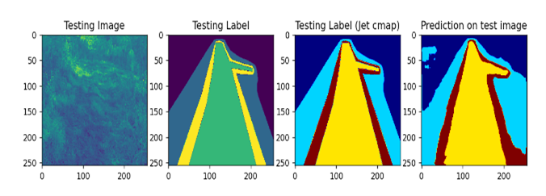

# Unet_models

## Real-Time Path Segmentation with U-Net

### Project Overview

This project focuses on the development and implementation of a U-Net architecture-based machine learning model for detecting off-road vehicle paths. The primary objective is to enable autonomous vehicles to navigate through unstructured and challenging off-road terrains by accurately identifying and segmenting navigable paths in real-time. The U-Net model, initially designed for biomedical image segmentation, has been adapted and trained to handle the complexities of off-road environments.

Path segmentation is crucial for autonomous off-road vehicles as it helps in understanding the terrain, identifying safe paths, and making real-time navigation decisions. By leveraging a pre-trained U-Net model, this project aims to achieve high accuracy in path detection, ensuring reliable and efficient autonomous navigation. The model processes images captured from a webcam or selected from the filesystem, performs segmentation, and provides directional guidance (left or right) based on the position of the segmented paths. This guidance is essential for making timely navigation adjustments, especially in dynamic and unpredictable off-road settings.

### Features
- **Real-time Path Segmentation Using a Webcam:** The model captures live frames from a webcam, segments the paths, and provides instant directional guidance.
- **Path Segmentation from Selected Image Files:** Users can select image files for segmentation, allowing for testing and validation of the model on various datasets.
- **Directional Guidance:** The system analyzes the position of the segmented path and suggests directional actions (left or right) to navigate the vehicle accordingly.

### Files in the Repository
- `Camera based prediction.py`: Script for capturing real-time frames from a webcam, segmenting the images, and determining directional guidance based on path position.
- `Image Browse and predict.py`: Script for selecting an image file, performing segmentation, and displaying the results along with directional guidance.
- `multi_unet_model.py`: Script defining the multi-class U-Net model used for segmentation.
- `MixedField_V2.hdf5`: Pre-trained weights for the U-Net model which was trained using [Mississippi State University's Dataset](https://www.cavs.msstate.edu/resources/autonomous_dataset.php).

### Requirements
- Python 3.x
- OpenCV
- NumPy
- Keras
- Matplotlib
- scikit-image

### Installation
1. Clone this repository:
    ```sh
    git clone https://github.com/TechDudeSid/Unet_models.git
    ```
2. Navigate to the project directory:
    ```sh
    cd Unet_models
    ```
3. Install the required packages:
    ```sh
    pip install -r requirements.txt
    ```

### Usage

#### Real-Time Segmentation from Webcam
1. Ensure your webcam is connected.
2. Run the `Camera based prediction.py` script:
    ```sh
    python Camera\ based\ prediction.py
    ```
3. The script will capture frames from the webcam, perform segmentation, and print "turn Left" or "turn Right" based on the position of the segmented path.

#### Segmentation from Selected Image Files
1. Run the `Image Browse and predict.py` script:
    ```sh
    python Image\ Browse\ and\ predict.py
    ```
2. A file dialog will appear. Select an image file to process.
3. The script will display the original image, the segmentation result, and the directional guidance (left or right).

### Model Details
The U-Net model used in this project is a convolutional neural network designed for biomedical image segmentation but adapted here for off-road path detection. It uses pre-trained weights loaded from `MixedField_V2.hdf5`. The model architecture is defined in the `multi_unet_model.py` script, which builds a multi-class U-Net model with customizable input dimensions and number of classes.

### Accuracy and Training Details
The U-Net model has demonstrated high accuracy in segmenting off-road paths:
- **Training Accuracy:** 97%
- **Testing Accuracy:** 93%
- **Number of Epochs:** 150

### Results
Here are some example segmentation results along with the corresponding directional guidance:

**Results**



### Acknowledgements
- The U-Net model implementation is adapted from the [original paper](https://arxiv.org/abs/1505.04597) by Olaf Ronneberger, Philipp Fischer, and Thomas Brox.
- This project utilizes the Keras deep learning library and OpenCV for image processing.
